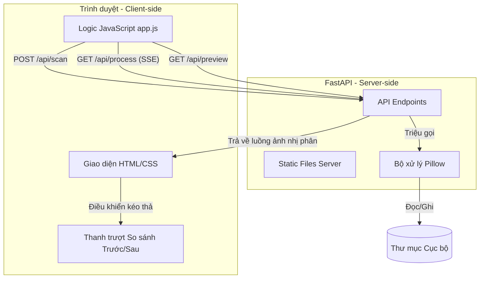

# Image Color Inverter Implementation Plan

> **For agentic workers:** REQUIRED SUB-SKILL: Use superpowers:subagent-driven-development to implement this plan task-by-task. Steps use checkbox (`- [ ]`) syntax for tracking.

**Goal:** Build a local client-server web application to batch process images in a directory, converting them to inverted grayscale, with a modern dark theme UI featuring a real-time progress bar and before/after image slider.

**Architecture:**
*   **Backend:** FastAPI server serving REST APIs (`/api/scan`, `/api/preview`), streaming processing updates using Server-Sent Events (`/api/process`), and serving the static frontend from `/static`.
*   **Processing:** Pillow library translates images to grayscale (`L`) and inverts them (`ImageOps.invert`).
*   **Frontend:** HTML5, Vanilla CSS, and Vanilla JS connecting to APIs and managing the UI states (initial, scanning, processing, preview).

**Architecture Diagram:**


**Tech Stack:**
*   Python 3.10+
*   FastAPI
*   Uvicorn
*   Pillow
*   Pytest & HTTPX (for backend testing)
*   Vanilla HTML5 / CSS3 / ES6 JavaScript

---

## Tasks

### Task 1: Project Setup and Dependencies
**Files:**
*   Create: [requirements.txt](file:///Users/caodinhtrihoang/Documents/HQs/Invert/requirements.txt)
*   Create: [main.py](file:///Users/caodinhtrihoang/Documents/HQs/Invert/main.py)
*   Create: [test_main.py](file:///Users/caodinhtrihoang/Documents/HQs/Invert/test_main.py)

- [ ] **Step 1: Write requirements.txt**
    Write the python package list to `requirements.txt`:
    ```text
    fastapi==0.111.0
    uvicorn==0.30.1
    pillow==10.3.0
    httpx==0.27.0
    pytest==8.2.2
    ```

- [ ] **Step 2: Create a failing test to verify setup**
    Create `test_main.py` with a simple health check test:
    ```python
    from fastapi.testclient import TestClient
    from main import app

    client = TestClient(app)

    def test_read_root():
        response = client.get("/api/health")
        assert response.status_code == 200
        assert response.json() == {"status": "ok"}
    ```

- [ ] **Step 3: Run the test to verify failure**
    Run: `python3 -m pytest test_main.py`
    Expected: Fail with `ModuleNotFoundError: No module named 'main'` (or import error).

- [ ] **Step 4: Create main.py to satisfy the test**
    Create `main.py` with a health check endpoint:
    ```python
    from fastapi import FastAPI

    app = FastAPI()

    @app.get("/api/health")
    def health_check():
        return {"status": "ok"}
    ```

- [ ] **Step 5: Install dependencies and run test to pass**
    Run: `pip install -r requirements.txt && python3 -m pytest test_main.py`
    Expected: Pass.

- [ ] **Step 6: Commit**
    Run:
    ```bash
    git add requirements.txt main.py test_main.py
    git commit -m "chore: initialize project dependencies and basic setup"
    ```

---

### Task 2: Scan Directory API (`POST /api/scan`)
**Files:**
*   Modify: [test_main.py](file:///Users/caodinhtrihoang/Documents/HQs/Invert/test_main.py)
*   Modify: [main.py](file:///Users/caodinhtrihoang/Documents/HQs/Invert/main.py)

- [ ] **Step 1: Write failing tests for /api/scan**
    Add tests to `test_main.py`:
    ```python
    import os
    import tempfile
    from PIL import Image

    def test_scan_invalid_directory():
        response = client.post("/api/scan", json={"folder_path": "/invalid/path/that/does/not/exist"})
        assert response.status_code == 400
        assert "Thư mục không tồn tại" in response.json()["detail"]

    def test_scan_valid_directory():
        with tempfile.TemporaryDirectory() as temp_dir:
            # Create a mock image
            img_path = os.path.join(temp_dir, "test.png")
            img = Image.new("RGB", (100, 100), color="white")
            img.save(img_path)

            response = client.post("/api/scan", json={"folder_path": temp_dir})
            assert response.status_code == 200
            data = response.json()
            assert data["success"] is True
            assert data["image_count"] == 1
            assert "test.png" in data["images"]
    ```

- [ ] **Step 2: Run test to verify failure**
    Run: `python3 -m pytest test_main.py -k test_scan`
    Expected: Fail with `404 Not Found`.

- [ ] **Step 3: Implement /api/scan endpoint in main.py**
    Modify `main.py` to add path validation and scanning:
    ```python
    import os
    from fastapi import FastAPI, HTTPException
    from pydantic import BaseModel

    # Add model
    class ScanRequest(BaseModel):
        folder_path: str

    # ... health check endpoint ...

    SUPPORTED_EXTENSIONS = {".png", ".jpg", ".jpeg", ".webp", ".bmp"}

    @app.post("/api/scan")
    def scan_directory(request: ScanRequest):
        # Prevent path traversal
        abs_path = os.path.abspath(request.folder_path)
        
        if not os.path.exists(abs_path):
            raise HTTPException(status_code=400, detail="Thư mục không tồn tại.")
        if not os.path.isdir(abs_path):
            raise HTTPException(status_code=400, detail="Đường dẫn không phải thư mục.")
            
        try:
            files = os.listdir(abs_path)
        except Exception as e:
            raise HTTPException(status_code=400, detail=f"Không thể đọc thư mục: {str(e)}")

        image_files = []
        for file in files:
            _, ext = os.path.splitext(file)
            if ext.lower() in SUPPORTED_EXTENSIONS:
                image_files.append(file)

        return {
            "success": True,
            "folder_path": abs_path,
            "image_count": len(image_files),
            "images": sorted(image_files)
        }
    ```

- [ ] **Step 4: Run test to verify it passes**
    Run: `python3 -m pytest test_main.py`
    Expected: Pass.

- [ ] **Step 5: Commit**
    Run:
    ```bash
    git add main.py test_main.py
    git commit -m "feat: implement directory scanning API with path safety checks"
    ```

---

### Task 3: Secure Preview API (`GET /api/preview`)
**Files:**
*   Modify: [test_main.py](file:///Users/caodinhtrihoang/Documents/HQs/Invert/test_main.py)
*   Modify: [main.py](file:///Users/caodinhtrihoang/Documents/HQs/Invert/main.py)

- [ ] **Step 1: Write failing tests for /api/preview**
    Add tests to `test_main.py`:
    ```python
    def test_preview_missing_file():
        response = client.get("/api/preview?path=/invalid/path/test.png")
        assert response.status_code == 400
        assert "Tập tin không tồn tại" in response.json()["detail"]

    def test_preview_valid_file():
        with tempfile.TemporaryDirectory() as temp_dir:
            img_path = os.path.join(temp_dir, "test.png")
            img = Image.new("RGB", (10, 10), color="red")
            img.save(img_path)

            response = client.get(f"/api/preview?path={img_path}")
            assert response.status_code == 200
            assert response.headers["content-type"] == "image/png"
    ```

- [ ] **Step 2: Run test to verify failure**
    Run: `python3 -m pytest test_main.py -k test_preview`
    Expected: Fail with `404 Not Found`.

- [ ] **Step 3: Implement /api/preview endpoint in main.py**
    Modify `main.py` using `FileResponse`:
    ```python
    from fastapi.responses import FileResponse
    import mimetypes

    @app.get("/api/preview")
    def preview_image(path: str):
        abs_path = os.path.abspath(path)
        
        if not os.path.exists(abs_path) or os.path.isdir(abs_path):
            raise HTTPException(status_code=400, detail="Tập tin không tồn tại.")
            
        _, ext = os.path.splitext(abs_path)
        if ext.lower() not in SUPPORTED_EXTENSIONS:
            raise HTTPException(status_code=400, detail="Định dạng tệp không hỗ trợ preview.")

        mime_type, _ = mimetypes.guess_type(abs_path)
        return FileResponse(abs_path, media_type=mime_type or "image/jpeg")
    ```

- [ ] **Step 4: Run test to verify it passes**
    Run: `python3 -m pytest test_main.py`
    Expected: Pass.

- [ ] **Step 5: Commit**
    Run:
    ```bash
    git add main.py test_main.py
    git commit -m "feat: implement secure preview API to serve local images"
    ```

---

### Task 4: Image Inversion Logic & SSE Stream API (`GET /api/process`)
**Files:**
*   Modify: [test_main.py](file:///Users/caodinhtrihoang/Documents/HQs/Invert/test_main.py)
*   Modify: [main.py](file:///Users/caodinhtrihoang/Documents/HQs/Invert/main.py)

- [ ] **Step 1: Write failing tests for /api/process**
    Add tests to `test_main.py`:
    ```python
    def test_process_images_sse():
        with tempfile.TemporaryDirectory() as temp_dir:
            # Create two test images
            for name in ["a.jpg", "b.png"]:
                img = Image.new("RGB", (100, 100), color="white")
                img.save(os.path.join(temp_dir, name))

            # Test the streaming endpoint
            with client.stream("GET", f"/api/process?folder_path={temp_dir}") as response:
                assert response.status_code == 200
                assert "text/event-stream" in response.headers["content-type"]
                
                # Check events streamed back
                events = [line for line in response.iter_lines() if line.startswith("data:")]
                assert len(events) >= 3 # 2 progress events + 1 complete event
                
                # Verify folders and inverted files are actually written
                output_dir = os.path.join(temp_dir, "inverted")
                assert os.path.exists(output_dir)
                assert os.path.exists(os.path.join(output_dir, "a.jpg"))
                assert os.path.exists(os.path.join(output_dir, "b.png"))

                # Verify image inversion occurred (white 255 becomes black 0)
                inverted_img = Image.open(os.path.join(output_dir, "a.jpg"))
                pixel = inverted_img.getpixel((0,0))
                # Because it's grayscale, a pixel will be a single int or a 1-tuple
                val = pixel[0] if isinstance(pixel, tuple) else pixel
                assert val == 0
    ```

- [ ] **Step 2: Run test to verify failure**
    Run: `python3 -m pytest test_main.py -k test_process`
    Expected: Fail with `404 Not Found`.

- [ ] **Step 3: Implement inversion logic & SSE in main.py**
    Modify `main.py` with the processing logic using `StreamingResponse`:
    ```python
    import json
    import asyncio
    from fastapi.responses import StreamingResponse
    from PIL import Image, ImageOps

    async def process_images_generator(folder_path: str):
        abs_path = os.path.abspath(folder_path)
        output_dir = os.path.join(abs_path, "inverted")
        
        # Ensure output directory exists
        os.makedirs(output_dir, exist_ok=True)

        try:
            files = sorted(os.listdir(abs_path))
        except Exception as e:
            yield f"data: {json.dumps({'type': 'error', 'message': f'Không thể đọc thư mục: {str(e)}'})}\n\n"
            return

        image_files = [f for f in files if os.path.splitext(f)[1].lower() in SUPPORTED_EXTENSIONS]
        total_count = len(image_files)

        if total_count == 0:
            yield f"data: {json.dumps({'type': 'complete', 'message': 'Không tìm thấy hình ảnh nào để xử lý.'})}\n\n"
            return

        for idx, filename in enumerate(image_files, start=1):
            src_file = os.path.join(abs_path, filename)
            dest_file = os.path.join(output_dir, filename)
            
            try:
                # Pillow Processing
                with Image.open(src_file) as img:
                    # Maintain orientation
                    img = ImageOps.exif_transpose(img)
                    # Convert to grayscale ('L')
                    gray_img = img.convert('L')
                    # Invert
                    inverted_img = ImageOps.invert(gray_img)
                    # Save with original format details
                    inverted_img.save(dest_file, format=img.format)
                
                # yield progress event
                progress = int((idx / total_count) * 100)
                event_data = {
                    "type": "progress",
                    "progress_percent": progress,
                    "completed_count": idx,
                    "total_count": total_count,
                    "current_file": filename,
                    "status": "success",
                    "message": f"Đã xử lý xong: {filename}"
                }
                yield f"data: {json.dumps(event_data)}\n\n"
                
            except Exception as e:
                # If single file fails, stream error, but continue loop
                progress = int((idx / total_count) * 100)
                event_data = {
                    "type": "progress",
                    "progress_percent": progress,
                    "completed_count": idx,
                    "total_count": total_count,
                    "current_file": filename,
                    "status": "error",
                    "message": f"Lỗi xử lý {filename}: {str(e)}"
                }
                yield f"data: {json.dumps(event_data)}\n\n"

            # Tiny sleep to ensure async yielding doesn't lock CPU
            await asyncio.sleep(0.01)

        # yield complete event
        complete_data = {
            "type": "complete",
            "message": f"Hoàn thành xử lý {total_count} hình ảnh. Đầu ra được lưu tại {output_dir}"
        }
        yield f"data: {json.dumps(complete_data)}\n\n"

    @app.get("/api/process")
    async def process_images(folder_path: str):
        abs_path = os.path.abspath(folder_path)
        if not os.path.exists(abs_path) or not os.path.isdir(abs_path):
            raise HTTPException(status_code=400, detail="Thư mục đầu vào không tồn tại.")
        
        return StreamingResponse(
            process_images_generator(abs_path),
            media_type="text/event-stream"
        )
    ```

- [ ] **Step 4: Run test to verify it passes**
    Run: `python3 -m pytest test_main.py`
    Expected: Pass all tests.

- [ ] **Step 5: Commit**
    Run:
    ```bash
    git add main.py test_main.py
    git commit -m "feat: implement Pillow image processing logic and SSE streaming API"
    ```

---

### Task 5: Static Files Mounting and Basic HTML/CSS
**Files:**
*   Create: [static/index.html](file:///Users/caodinhtrihoang/Documents/HQs/Invert/static/index.html)
*   Create: [static/style.css](file:///Users/caodinhtrihoang/Documents/HQs/Invert/static/style.css)
*   Modify: [main.py](file:///Users/caodinhtrihoang/Documents/HQs/Invert/main.py)

- [ ] **Step 1: Write static/index.html**
    Create a clean, responsive layout with cards:
    ```html
    <!DOCTYPE html>
    <html lang="vi">
    <head>
        <meta charset="UTF-8">
        <meta name="viewport" content="width=device-width, initial-scale=1.0">
        <title>VisionInvert - Đảo Ngược Màu Trắng Đen Ảnh Hàng Loạt</title>
        <link rel="stylesheet" href="style.css">
        <link rel="preconnect" href="https://fonts.googleapis.com">
        <link rel="preconnect" href="https://fonts.gstatic.com" crossorigin>
        <link href="https://fonts.googleapis.com/css2?family=Outfit:wght@300;400;600;700&display=swap" rel="stylesheet">
    </head>
    <body>
        <div class="glow-bg"></div>
        <div class="container">
            <header>
                <div class="logo">
                    <span class="icon">🌓</span>
                    <h1>VisionInvert</h1>
                    <span class="version">v1.0</span>
                </div>
                <p class="subtitle">Chuyển đổi hình ảnh hàng loạt sang âm bản trắng đen chất lượng cao</p>
            </header>

            <main class="dashboard">
                <section class="control-panel">
                    <!-- Card 1: Input Location -->
                    <div class="card glass">
                        <h2>Vị trí thư mục</h2>
                        <div class="input-group">
                            <span class="folder-icon">📁</span>
                            <input type="text" id="folder-path" placeholder="Nhập đường dẫn tuyệt đối (VD: /Users/username/Pictures)">
                        </div>
                        <button id="btn-scan" class="btn primary">Quét thư mục</button>
                    </div>

                    <!-- Card 2: Status & Stats -->
                    <div id="status-card" class="card glass hidden">
                        <h2>Trạng thái xử lý</h2>
                        <div class="stats-row">
                            <div class="stat-box">
                                <span class="stat-val" id="stat-total">0</span>
                                <span class="stat-lbl">Tệp tìm thấy</span>
                            </div>
                            <div class="stat-box">
                                <span class="stat-val" id="stat-done">0</span>
                                <span class="stat-lbl">Đã xử lý</span>
                            </div>
                        </div>
                        <div class="progress-container">
                            <div class="progress-bar-bg">
                                <div id="progress-bar" class="progress-bar-fill"></div>
                            </div>
                            <span id="progress-text" class="progress-text">0%</span>
                        </div>
                        <button id="btn-start" class="btn success full-width hidden">Bắt đầu đảo ngược</button>
                    </div>

                    <!-- Card 3: Processed Files List -->
                    <div id="files-card" class="card glass hidden">
                        <h2>Danh sách tệp tin</h2>
                        <div class="file-list-wrapper">
                            <ul id="file-list" class="file-list"></ul>
                        </div>
                    </div>
                </section>

                <section class="preview-panel">
                    <!-- Card 4: Before / After Slider -->
                    <div class="card glass preview-card">
                        <h2>So sánh Trước / Sau</h2>
                        <div class="preview-placeholder" id="preview-placeholder">
                            <span class="placeholder-icon">👁️</span>
                            <p>Chọn một tệp tin đã xử lý từ danh sách để xem trước so sánh</p>
                        </div>
                        <div class="slider-container hidden" id="slider-container">
                            <div class="slider-img-wrapper">
                                
                                <div class="slider-resize-box" id="slider-resize-box">
                                    
                                </div>
                                <div class="slider-handle" id="slider-handle">
                                    <div class="slider-handle-line"></div>
                                    <div class="slider-handle-button">↔</div>
                                </div>
                            </div>
                            <div class="slider-labels">
                                <span>Ảnh gốc</span>
                                <span>Đảo ngược</span>
                            </div>
                        </div>
                    </div>
                </section>
            </main>
        </div>
        <script src="app.js"></script>
    </body>
    </html>
    ```

- [ ] **Step 2: Write static/style.css**
    Create rich glassmorphic cards and slider logic:
    ```css
    :root {
        --bg-color: #0b0f19;
        --card-bg: rgba(22, 28, 45, 0.45);
        --card-border: rgba(255, 255, 255, 0.08);
        --text-color: #f1f5f9;
        --text-muted: #94a3b8;
        --primary-color: #6366f1;
        --primary-hover: #4f46e5;
        --success-color: #10b981;
        --success-hover: #059669;
        --accent-glow: rgba(99, 102, 241, 0.15);
    }

    * {
        box-sizing: border-box;
        margin: 0;
        padding: 0;
        font-family: 'Outfit', sans-serif;
    }

    body {
        background-color: var(--bg-color);
        color: var(--text-color);
        min-height: 100vh;
        overflow-x: hidden;
        position: relative;
    }

    .glow-bg {
        position: absolute;
        width: 600px;
        height: 600px;
        background: radial-gradient(circle, rgba(99, 102, 241, 0.15) 0%, rgba(139, 92, 246, 0.05) 50%, rgba(0,0,0,0) 100%);
        top: -100px;
        right: -100px;
        z-index: -1;
        pointer-events: none;
    }

    .container {
        max-width: 1200px;
        margin: 0 auto;
        padding: 2rem 1.5rem;
    }

    header {
        margin-bottom: 2.5rem;
    }

    .logo {
        display: flex;
        align-items: center;
        gap: 0.75rem;
        margin-bottom: 0.5rem;
    }

    .logo h1 {
        font-size: 2rem;
        font-weight: 700;
        background: linear-gradient(135deg, #a78bfa, #38bdf8);
        -webkit-background-clip: text;
        -webkit-text-fill-color: transparent;
    }

    .version {
        font-size: 0.75rem;
        background: rgba(255,255,255,0.1);
        padding: 0.2rem 0.5rem;
        border-radius: 9999px;
        color: var(--text-muted);
    }

    .subtitle {
        color: var(--text-muted);
        font-size: 1rem;
    }

    .dashboard {
        display: grid;
        grid-template-columns: 1fr 1.2fr;
        gap: 2rem;
    }

    @media (max-width: 900px) {
        .dashboard {
            grid-template-columns: 1fr;
        }
    }

    .card {
        background: var(--card-bg);
        border: 1px solid var(--card-border);
        border-radius: 16px;
        padding: 1.5rem;
        margin-bottom: 1.5rem;
        box-shadow: 0 10px 30px rgba(0, 0, 0, 0.2);
    }

    .glass {
        backdrop-filter: blur(12px);
        -webkit-backdrop-filter: blur(12px);
    }

    .hidden {
        display: none !important;
    }

    h2 {
        font-size: 1.2rem;
        margin-bottom: 1.25rem;
        color: var(--text-color);
        font-weight: 600;
    }

    .input-group {
        display: flex;
        align-items: center;
        background: rgba(0, 0, 0, 0.25);
        border: 1px solid var(--card-border);
        border-radius: 8px;
        padding: 0.75rem 1rem;
        margin-bottom: 1rem;
        transition: border-color 0.2s;
    }

    .input-group:focus-within {
        border-color: var(--primary-color);
    }

    .input-group input {
        background: transparent;
        border: none;
        outline: none;
        color: white;
        width: 100%;
        font-size: 0.95rem;
        margin-left: 0.5rem;
    }

    .btn {
        width: 100%;
        padding: 0.75rem 1.5rem;
        border: none;
        border-radius: 8px;
        font-size: 0.95rem;
        font-weight: 600;
        cursor: pointer;
        transition: all 0.2s;
        display: flex;
        justify-content: center;
        align-items: center;
        gap: 0.5rem;
    }

    .btn.primary {
        background: var(--primary-color);
        color: white;
    }

    .btn.primary:hover {
        background: var(--primary-hover);
    }

    .btn.success {
        background: var(--success-color);
        color: white;
    }

    .btn.success:hover {
        background: var(--success-hover);
    }

    .stats-row {
        display: flex;
        gap: 1rem;
        margin-bottom: 1.25rem;
    }

    .stat-box {
        flex: 1;
        background: rgba(0, 0, 0, 0.2);
        border-radius: 8px;
        padding: 0.75rem;
        text-align: center;
        border: 1px solid var(--card-border);
    }

    .stat-val {
        display: block;
        font-size: 1.5rem;
        font-weight: 700;
        color: #38bdf8;
    }

    .stat-lbl {
        font-size: 0.75rem;
        color: var(--text-muted);
    }

    .progress-container {
        margin-bottom: 1rem;
        display: flex;
        align-items: center;
        gap: 1rem;
    }

    .progress-bar-bg {
        flex: 1;
        height: 8px;
        background: rgba(255, 255, 255, 0.1);
        border-radius: 4px;
        overflow: hidden;
    }

    .progress-bar-fill {
        width: 0%;
        height: 100%;
        background: linear-gradient(90deg, var(--primary-color), #38bdf8);
        transition: width 0.2s ease;
    }

    .progress-text {
        font-size: 0.85rem;
        font-weight: 600;
        min-width: 35px;
    }

    .file-list-wrapper {
        max-height: 250px;
        overflow-y: auto;
    }

    .file-list-wrapper::-webkit-scrollbar {
        width: 6px;
    }

    .file-list-wrapper::-webkit-scrollbar-thumb {
        background: rgba(255,255,255,0.1);
        border-radius: 99px;
    }

    .file-list {
        list-style: none;
    }

    .file-item {
        display: flex;
        justify-content: space-between;
        align-items: center;
        padding: 0.75rem 0.5rem;
        border-bottom: 1px solid rgba(255, 255, 255, 0.05);
        font-size: 0.85rem;
        cursor: pointer;
        border-radius: 6px;
        transition: background-color 0.2s;
    }

    .file-item:hover {
        background: rgba(255, 255, 255, 0.05);
    }

    .file-info {
        display: flex;
        align-items: center;
        gap: 0.5rem;
        overflow: hidden;
        text-overflow: ellipsis;
        white-space: nowrap;
    }

    .file-thumb {
        width: 32px;
        height: 32px;
        border-radius: 4px;
        object-fit: cover;
        background: rgba(0,0,0,0.3);
    }

    .badge {
        padding: 0.2rem 0.4rem;
        border-radius: 4px;
        font-size: 0.7rem;
        font-weight: 600;
    }

    .badge.waiting { background: rgba(255,255,255,0.1); color: var(--text-muted); }
    .badge.processing { background: rgba(99, 102, 241, 0.2); color: #818cf8; }
    .badge.success { background: rgba(16, 185, 129, 0.2); color: #34d399; }
    .badge.error { background: rgba(239, 68, 68, 0.2); color: #f87171; }

    /* Before After Image Slider Component */
    .preview-card {
        height: 100%;
        display: flex;
        flex-direction: column;
    }

    .preview-placeholder {
        flex: 1;
        display: flex;
        flex-direction: column;
        justify-content: center;
        align-items: center;
        text-align: center;
        color: var(--text-muted);
        padding: 3rem 0;
        border: 2px dashed rgba(255,255,255,0.05);
        border-radius: 8px;
    }

    .placeholder-icon {
        font-size: 3rem;
        margin-bottom: 1rem;
    }

    .slider-container {
        position: relative;
        width: 100%;
        overflow: hidden;
        border-radius: 8px;
        border: 1px solid var(--card-border);
        box-shadow: 0 4px 15px rgba(0,0,0,0.3);
        margin: auto 0;
    }

    .slider-img-wrapper {
        position: relative;
        width: 100%;
        height: 0;
        padding-bottom: 125%; /* 4:5 ratio */
        user-select: none;
    }

    .slider-img-wrapper img {
        position: absolute;
        left: 0;
        top: 0;
        width: 100%;
        height: 100%;
        object-fit: contain;
        background: #1e293b;
    }

    .slider-resize-box {
        position: absolute;
        left: 0;
        top: 0;
        width: 50%;
        height: 100%;
        overflow: hidden;
        border-right: 2px solid white;
        z-index: 2;
    }

    .slider-resize-box img {
        width: 100%;
        height: 100%;
        object-fit: contain;
    }

    .slider-handle {
        position: absolute;
        top: 0;
        left: 50%;
        width: 4px;
        height: 100%;
        background: white;
        cursor: ew-resize;
        z-index: 3;
        transform: translateX(-50%);
    }

    .slider-handle-button {
        position: absolute;
        top: 50%;
        left: 50%;
        transform: translate(-50%, -50%);
        width: 36px;
        height: 36px;
        background: white;
        color: #0b0f19;
        border-radius: 50%;
        display: flex;
        justify-content: center;
        align-items: center;
        font-weight: 700;
        box-shadow: 0 4px 10px rgba(0,0,0,0.4);
    }

    .slider-labels {
        display: flex;
        justify-content: space-between;
        padding: 0.75rem 0;
        font-size: 0.85rem;
        color: var(--text-muted);
        font-weight: 600;
    }
    ```

- [ ] **Step 3: Modify main.py to mount static folder**
    Add `StaticFiles` mounting to serve the static frontend files:
    ```python
    from fastapi.staticfiles import StaticFiles

    # ... health, scan, preview, process routes ...

    # Mount static directory at the root
    app.mount("/", StaticFiles(directory="static", html=True), name="static")
    ```

- [ ] **Step 4: Verify static server runs**
    Run: `mkdir -p static`
    (Then save index.html and style.css in it, then run test manually or check server startup)
    Run uvicorn: `uvicorn main:app --port 8000`
    Expected: Uvicorn starts up, handles requests correctly.

- [ ] **Step 5: Commit**
    Run:
    ```bash
    git add static/index.html static/style.css main.py
    git commit -m "feat: serve HTML UI structure and glassmorphism styling from backend"
    ```

---

### Task 6: Javascript Logic & Interactive Features
**Files:**
*   Create: [static/app.js](file:///Users/caodinhtrihoang/Documents/HQs/Invert/static/app.js)

- [ ] **Step 1: Write static/app.js**
    Write the logic for folder scanning, EventSource stream updates, and interactive split-screen slider:
    ```javascript
    document.addEventListener("DOMContentLoaded", () => {
        const btnScan = document.getElementById("btn-scan");
        const btnStart = document.getElementById("btn-start");
        const folderInput = document.getElementById("folder-path");
        
        const statusCard = document.getElementById("status-card");
        const filesCard = document.getElementById("files-card");
        const statTotal = document.getElementById("stat-total");
        const statDone = document.getElementById("stat-done");
        
        const progressBar = document.getElementById("progress-bar");
        const progressText = document.getElementById("progress-text");
        const fileList = document.getElementById("file-list");
        
        const previewPlaceholder = document.getElementById("preview-placeholder");
        const sliderContainer = document.getElementById("slider-container");
        const imgOriginal = document.getElementById("img-original");
        const imgInverted = document.getElementById("img-inverted");
        
        const sliderHandle = document.getElementById("slider-handle");
        const sliderResizeBox = document.getElementById("slider-resize-box");
        
        let scannedFolder = "";
        let imagesList = [];
        let eventSource = null;

        // 1. SCAN DIRECTORY
        btnScan.addEventListener("click", async () => {
            const folderPath = folderInput.value.trim();
            if (!folderPath) {
                alert("Vui lòng nhập đường dẫn thư mục!");
                return;
            }

            try {
                btnScan.disabled = true;
                btnScan.innerText = "Đang quét...";
                
                const res = await fetch("/api/scan", {
                    method: "POST",
                    headers: { "Content-Type": "application/json" },
                    body: JSON.stringify({ folder_path: folderPath })
                });

                const data = await res.json();
                if (!res.ok) {
                    throw new Error(data.detail || "Không thể quét thư mục");
                }

                scannedFolder = data.folder_path;
                imagesList = data.images;

                // Show/update cards
                statusCard.classList.remove("hidden");
                filesCard.classList.remove("hidden");
                btnStart.classList.remove("hidden");
                btnStart.disabled = false;
                btnStart.innerText = "Bắt đầu đảo ngược";

                statTotal.innerText = data.image_count;
                statDone.innerText = "0";
                progressBar.style.width = "0%";
                progressText.innerText = "0%";

                // Render File List
                renderFileList();
            } catch (err) {
                alert("Lỗi: " + err.message);
                statusCard.classList.add("hidden");
                filesCard.classList.add("hidden");
                btnStart.classList.add("hidden");
            } finally {
                btnScan.disabled = false;
                btnScan.innerText = "Quét thư mục";
            }
        });

        function renderFileList() {
            fileList.innerHTML = "";
            imagesList.forEach(filename => {
                const li = document.createElement("li");
                li.className = "file-item";
                li.innerHTML = `
                    <div class="file-info">
                        
                        <span>${filename}</span>
                    </div>
                    <span class="badge waiting" id="badge-${filename.replace(/[^a-zA-Z0-9]/g, '_')}">Chờ xử lý</span>
                `;
                
                // Clicking file shows preview (if processed, show slider; if not, show placeholder)
                li.addEventListener("click", () => {
                    const badge = document.getElementById(`badge-${filename.replace(/[^a-zA-Z0-9]/g, '_')}`);
                    if (badge.classList.contains("success")) {
                        showPreview(filename);
                    } else {
                        alert("File này chưa được xử lý xong. Hãy bắt đầu đảo ngược trước!");
                    }
                });
                
                fileList.appendChild(li);
            });
        }

        // 2. PROCESS IMAGES (SSE)
        btnStart.addEventListener("click", () => {
            if (!scannedFolder) return;
            
            btnStart.disabled = true;
            btnStart.innerText = "Đang đảo ngược...";

            if (eventSource) {
                eventSource.close();
            }

            eventSource = new EventSource(`/api/process?folder_path=${encodeURIComponent(scannedFolder)}`);

            eventSource.onmessage = (event) => {
                const data = JSON.parse(event.data);
                
                if (data.type === "progress") {
                    statDone.innerText = data.completed_count;
                    progressBar.style.width = `${data.progress_percent}%`;
                    progressText.innerText = `${data.progress_percent}%`;

                    // Update item status badge
                    const badgeId = `badge-${data.current_file.replace(/[^a-zA-Z0-9]/g, '_')}`;
                    const badge = document.getElementById(badgeId);
                    if (badge) {
                        if (data.status === "success") {
                            badge.className = "badge success";
                            badge.innerText = "Thành công";
                            // Also update thumbnail with inverted image
                            const thumb = badge.previousElementSibling.querySelector(".file-thumb");
                            thumb.src = `/api/preview?path=${encodeURIComponent(scannedFolder + '/inverted/' + data.current_file)}&t=${Date.now()}`;
                        } else {
                            badge.className = "badge error";
                            badge.innerText = "Lỗi";
                        }
                    }
                } else if (data.type === "complete") {
                    eventSource.close();
                    btnStart.innerText = "Hoàn thành!";
                    setTimeout(() => {
                        btnStart.innerText = "Bắt đầu đảo ngược";
                        btnStart.disabled = false;
                    }, 3000);
                    alert(data.message);
                }
            };

            eventSource.onerror = (err) => {
                console.error("SSE Error:", err);
                eventSource.close();
                btnStart.innerText = "Gặp lỗi kết nối";
                btnStart.disabled = false;
            };
        });

        // 3. SHOW PREVIEW
        function showPreview(filename) {
            previewPlaceholder.classList.add("hidden");
            sliderContainer.classList.remove("hidden");
            
            const originalPath = scannedFolder + '/' + filename;
            const invertedPath = scannedFolder + '/inverted/' + filename;
            
            imgOriginal.src = `/api/preview?path=${encodeURIComponent(originalPath)}`;
            imgInverted.src = `/api/preview?path=${encodeURIComponent(invertedPath)}`;
            
            // Reset slider position to 50%
            sliderResizeBox.style.width = "50%";
            sliderHandle.style.left = "50%";
        }

        // 4. BEFORE/AFTER SLIDER INTERACTIVE DRAG
        let isDragging = false;
        
        function getMouseX(e) {
            const rect = sliderContainer.getBoundingClientRect();
            const clientX = e.touches ? e.touches[0].clientX : e.clientX;
            let x = clientX - rect.left;
            x = Math.max(0, Math.min(x, rect.width));
            return (x / rect.width) * 100;
        }

        function slide(pct) {
            sliderResizeBox.style.width = `${pct}%`;
            sliderHandle.style.left = `${pct}%`;
        }

        const startDragging = () => { isDragging = true; };
        const stopDragging = () => { isDragging = false; };
        const onDrag = (e) => {
            if (!isDragging) return;
            const pct = getMouseX(e);
            slide(pct);
        };

        sliderHandle.addEventListener("mousedown", startDragging);
        sliderHandle.addEventListener("touchstart", startDragging);
        
        window.addEventListener("mouseup", stopDragging);
        window.addEventListener("touchend", stopDragging);
        
        window.addEventListener("mousemove", onDrag);
        window.addEventListener("touchmove", onDrag);
    });
    ```

- [ ] **Step 2: Start server and do manual verification**
    Run the server: `python3 -m uvicorn main:app --reload --port 8000`
    Visit: `http://localhost:8000` in browser. Test the layout, drag and drop / input directories, verify scanning and processing, check slider controls.

- [ ] **Step 3: Commit**
    Run:
    ```bash
    git add static/app.js
    git commit -m "feat: add app.js logic for SSE tracking and before-after preview slider"
    ```
