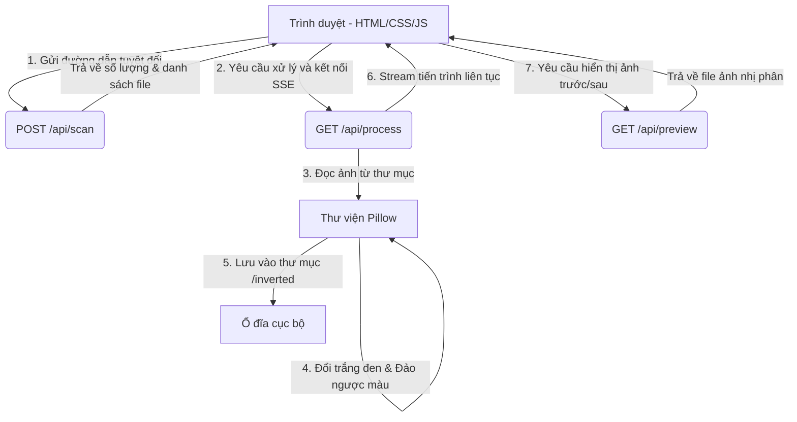

# Tài Liệu Thiết Kế: Ứng Dụng Đảo Ngược Màu Trắng Đen Hình Ảnh (Invertify)

Tài liệu này mô tả chi tiết thiết kế kỹ thuật cho ứng dụng web cục bộ giúp chuyển đổi hàng loạt hình ảnh trong thư mục sang dạng trắng đen đảo ngược màu (Grayscale + Inverted).

---

## 1. Yêu Cầu & Phạm Vi Hệ Thống

*   **Mục tiêu:** Cho phép người dùng nhập đường dẫn thư mục tuyệt đối trên máy tính thông qua trình duyệt, quét các hình ảnh trong thư mục đó và thực hiện đảo ngược màu trắng đen hàng loạt.
*   **Công nghệ sử dụng:**
    *   **Backend:** Python 3 (FastAPI, Uvicorn, Pillow).
    *   **Frontend:** HTML5, CSS3 (Vanilla CSS, Dark Mode, phong cách Modern Card & Glassmorphism), JavaScript (Vanilla JS, EventSource).
*   **Phạm vi xử lý:**
    *   Chỉ quét các file hình ảnh nằm trực tiếp tại thư mục được chọn (không quét đệ quy các thư mục con).
    *   Các định dạng hỗ trợ: `.png`, `.jpg`, `.jpeg`, `.webp`, `.bmp`.
    *   Kết quả xuất ra sẽ lưu vào một thư mục mới tên là `inverted/` nằm bên trong thư mục gốc.

---

## 2. Thiết Kế Kiến Trúc & API Endpoints

Ứng dụng chạy cục bộ trên máy tính của người dùng theo mô hình Client-Server.



### Chi tiết các API Endpoints

#### A. Quét thư mục
*   **Endpoint:** `POST /api/scan`
*   **Mô tả:** Kiểm tra đường dẫn thư mục có hợp lệ không và đếm số lượng hình ảnh phù hợp.
*   **Yêu cầu (JSON):**
    ```json
    {
      "folder_path": "/Users/username/Pictures/Test"
    }
    ```
*   **Phản hồi thành công (200 OK):**
    ```json
    {
      "success": true,
      "folder_path": "/Users/username/Pictures/Test",
      "image_count": 12,
      "images": ["photo1.jpg", "photo2.png"]
    }
    ```

#### B. Xử lý ảnh và Stream tiến trình (SSE)
*   **Endpoint:** `GET /api/process?folder_path=/Users/username/Pictures/Test`
*   **Mô tả:** Thực hiện xử lý từng file ảnh, ghi kết quả xuống ổ đĩa và stream tiến trình về Client theo thời gian thực.
*   **Dạng phản hồi:** `text/event-stream`
*   **Sự kiện tiến trình (progress):**
    ```json
    {
      "type": "progress",
      "progress_percent": 50,
      "completed_count": 6,
      "total_count": 12,
      "current_file": "photo6.jpg",
      "status": "success",
      "message": "Đã xử lý photo6.jpg"
    }
    ```

#### C. Xem trước ảnh (Preview)
*   **Endpoint:** `GET /api/preview?path=/Users/username/Pictures/Test/photo1.jpg`
*   **Mô tả:** Đọc file ảnh cục bộ và trả về dữ liệu nhị phân kèm `Content-Type` tương ứng để hiển thị trên trình duyệt.

---

## 3. Thuật Toán Xử Lý Hình Ảnh & Bảo Mật

### Thuật toán xử lý (Pillow):
1.  Đọc ảnh bằng `Image.open(path)`.
2.  Tự động xoay ảnh đúng chiều dựa trên dữ liệu EXIF: `ImageOps.exif_transpose(image)`.
3.  Chuyển sang ảnh xám (Grayscale): `image.convert('L')`.
4.  Đảo màu (Invert): `ImageOps.invert(grayscale_image)`.
5.  Lưu ảnh vào thư mục `inverted/` với định dạng và tên file gốc.

### Bảo mật & Ổn định hệ thống:
*   Chuyển đổi đường dẫn nhập vào thành đường dẫn tuyệt đối chuẩn hóa bằng `os.path.abspath` để tránh các lỗi hoặc lỗ hổng đi ngược thư mục (`../`).
*   Xử lý ngoại lệ trên từng tập tin: Nếu một ảnh bị lỗi hoặc hỏng, ứng dụng sẽ tiếp tục xử lý các ảnh tiếp theo và gửi thông tin lỗi chi tiết của ảnh đó lên UI thay vì dừng toàn bộ tiến trình.

---

## 4. Thiết Kế Giao Diện Người Dùng (UI/UX)

Giao diện được xây dựng bằng HTML/CSS/JS thuần, sử dụng bảng màu tối (Dark Palette) và các hiệu ứng hiện đại:
*   **Bảng màu chủ đạo:** Slate đen sâu làm nền, các thẻ màu xám tối bán trong suốt (glassmorphic), các nút điều khiển màu xanh dương và hiệu ứng neon tím/xanh.
*   **Chức năng chính:**
    *   **Nhập đường dẫn:** Ô nhập text trực quan cùng hướng dẫn định dạng đường dẫn.
    *   **Thống kê:** Hiển thị tổng số lượng ảnh được tìm thấy sau khi quét.
    *   **Thành tiến trình:** Chuyển động mượt mà bằng CSS transitions cập nhật theo phần trăm SSE.
    *   **Bảng điều khiển so sánh (Live Preview):** Widget kéo thanh trượt (slider) trước/sau cho phép so sánh ảnh gốc và ảnh đảo ngược màu ngay trên web.
